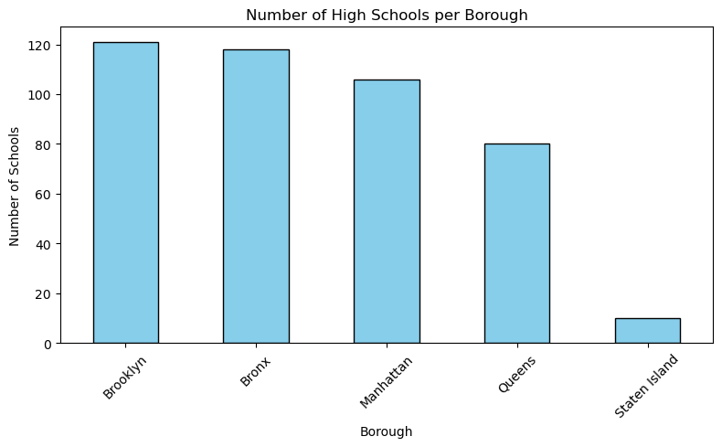
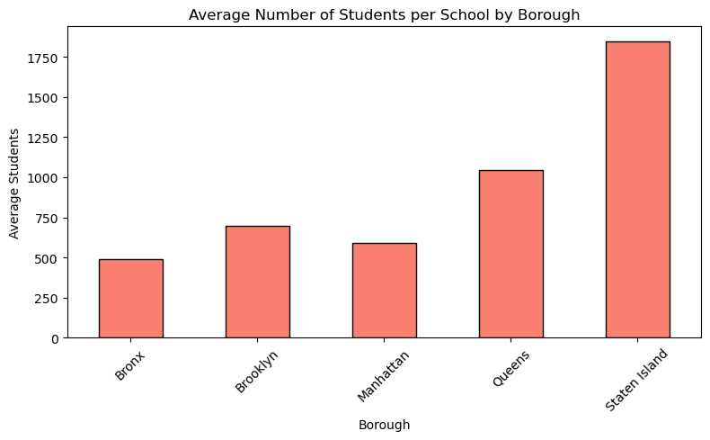

# NYC School Analysis

This repository consolidates multiple analyses of **New York City schools**, including **school directories, incident reports, student demographics, and SAT results**. The project uses Python, Pandas, Matplotlib, and PostgreSQL to clean, aggregate, and visualize data.

---

## Project Structure
nyc-school-analysis/
│
├─ nyc_school_directory/
│ ├─ data/
│ │ └─ high-school-directory.csv
│ ├─ visualizations/
│ │ ├─ bar_number_of_schools_per_borough.png
│ │ └─ bar_average_number_of_students_per_school_by_borough.png
│ ├─ high_school_directory_analysis.ipynb
│ └─ README.md
│
├─ database_exploration/
│ ├─ README.md
│ └─ sql_analysis.ipynb
│
├─ nyc_school_incident_analysis/
│ ├─ data/
│ │ ├─ high_school_directory_analysis.xlsx
│ │ ├─ school_safety_report_data_dictionary.xlsx
│ │ └─ school_safety_report_origin_data.csv
│ └─ README.md
│
├─ population_database/
│ ├─ data/
│ │ ├─ sat-results.csv
│ │ └─ sat-results-cleaned.csv
│ ├─ sat_modeling.ipynb
│ └─ README.md
│
├─ .gitignore
├─ environment.yml
└─ README.md

---

## Environment Setup

This project uses a **Conda environment** to provide all required packages in fixed versions.

### Conda Environment

The environment is defined in `environment.yml`.

**Create the environment:**

```bash
conda env create -f environment.yml
```
**Activate the environment:**

```bash
conda activate ds
```
**Note:**
This environment contains all packages for **data extraction, filtering, merging, SQL interactions, and analysis**, including data visualization. Package versions are fixed to ensure reproducible results.

## Module Overview
### **1. NYC School Incident Analysis**

- **Goal:** Analyze incident reports in NYC schools from Google Sheets
- Analysis Objectives

The analysis specifically aimed to answer the following questions:

  1. **How many total rows are there?**  
   - This provides an overview of the dataset size before cleaning.
  2. **How many unique schools are listed? (dbn)**  
   - Identifies the number of distinct schools represented in the data.
  3. **What is the most frequent incident type?**  
   - Determines which type of incidents (major crimes, other crimes, non-criminal incidents, property crimes, or violent crimes) occur most often.
  4. **What percentage of incidents occurred in the Bronx?**  
   - Measures the borough-level distribution of incidents to highlight areas with higher safety concerns.

- **Tasks:**

    - Clean and normalize data
    - Calculate aggregated metrics
    - Identify and flag duplicate records
    - Borough-level analysis (e.g., incidents in the Bronx)

- **Results:**

    - Dataset contains **6,309 rows** with **1,890 unique schools**
    - Total incidents across all boroughs: **28,151**
    - Total average incidents across all boroughs: **27,963.21**
    - Most frequent incident type: **Non-criminal incidents (11,772 occurrences)**
    - The Bronx accounts for **28.3% of total incidents**
    - **Duplicate handling**: Full duplicates removed, partial duplicates flagged for review

- **Files:** `nyc_school_incident_analysis/README.md`, Excel/CSV datasets

### 2. High School Directory Analysis

- **Goal:** Examine NYC high schools by count, student numbers, and grade levels

- **Tasks:**

    - Data cleaning and standardization of column names
    - Select relevant variables
    - Filter by boroughs and grade levels
    - Aggregate and visualize school statistics

- **Results:**

    - Brooklyn: highest number of schools (121), followed by Bronx and Manhattan
    - All Brooklyn schools accept 9th grade, showing broad coverage from the typical high school entry point.
    - Average starting grades vary: - Brooklyn: 8.43 → some schools integrate middle school (grades 6–8) - Queens: 8.39 - Staten Island: 9.00 → pure high schools
    - Student count per school varies significantly across boroughs: - Staten Island has few, but large schools - Brooklyn and Manhattan have many, moderately sized schools
    - Grade structures are consistent, almost all schools reach grade 12.
  
- **Visualizations:**

  - Number of Schools per Borough 
    
  - Average Students per School
    


- **Files:** `nyc_school_directory/high_school_directory_analysis.ipynb`, visualizations in `visualizations/`

### 3. NYC High School Demographics (SQL Analysis)

- **Goal:** Analyze enrollment, English Language Learners (ELL), and Special Education (SPED) by school and borough

- **Tasks:**

    - SQL-based aggregation and filtering:
  
        - School distribution across boroughs
        - English Language Learners (ELL)
        - Special Education (SPED) student representation

- **Results:**

    1. School Distribution

        - Brooklyn has the highest number of high schools
        - Staten Island has very few, but typically larger schools
  
    2.Data Completeness Issues

        - ELL and SPED data is largely missing for Bronx, Brooklyn, Queens, and Staten Island
        - Manhattan has the most complete demographic coverage

    3. Special Education Concentration

        - The highest SPED percentages are observed in Manhattan schools
        - Other boroughs cannot be reliably compared due to missing data

    4. Data gaps identified in other boroughs

- **Files:** `database_exploration/sql_analysis.ipynb`, PostgreSQL queries

### 4. SAT Results Data Cleaning & PostgreSQL Integration

- **Goal:** Clean, validate, and integrate NYC high school SAT results into PostgreSQL

- **Tasks:**

    - Standardize column names
    - Handle missing or invalid values
    - Convert data types for PostgreSQL compatibility
    - Batch insertion with conflict handling

- **Results:**

    - 421 cleaned records successfully inserted or updated
    - Table `alexandra_dernova_sat_scores` ready for analysis

- **Files:** `population_database/sat_modeling.ipynb, data/sat-results.csv`

## Next Steps

- Further validate ELL and SPED data coverage
- Extend analyses to additional metrics and time periods
- Integrate visualizations and reports into a dashboard
- Ensure reproducibility through dataset and environment versioning

## License & Notes

- This project is intended for learning and analytical purposes.
- Data sources are public NYC education datasets or anonymized.
- In production, database credentials and sensitive information should be securely stored (e.g., using `.env` files or a secrets manager).